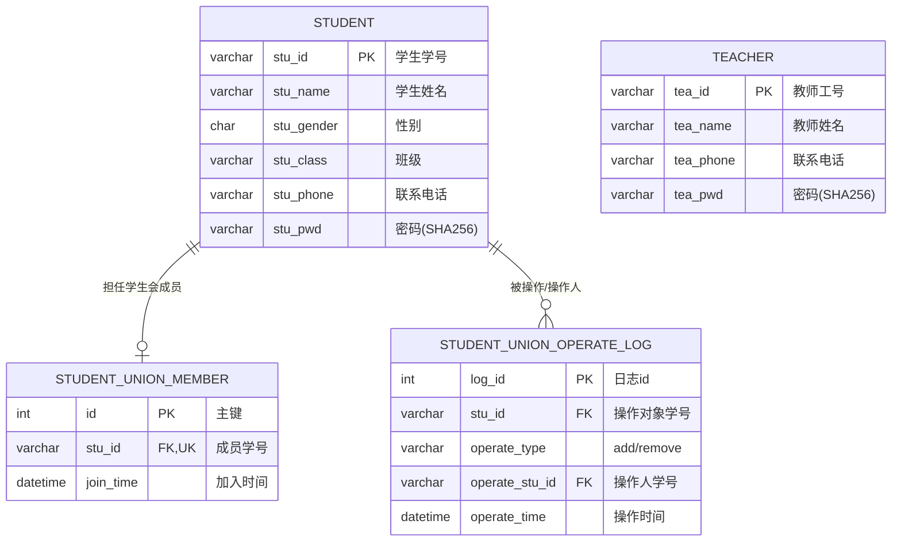
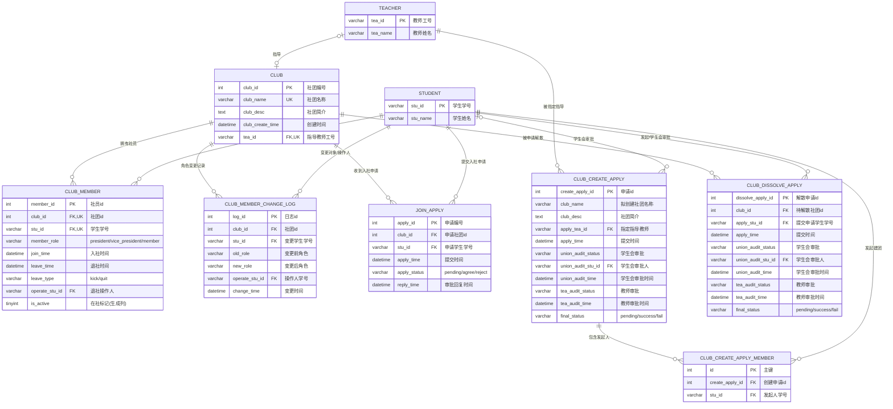
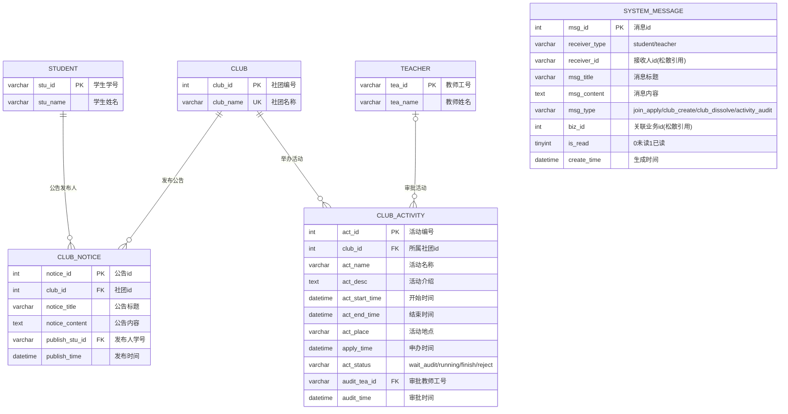

# 学生社团管理系统 — ER 图设计文档

> 数据库：club_manage（MySQL 5.7 / 8.0）　表数量：14 张
> 配套文件：[sql.sql](sql.sql)（表结构）、[triggers.sql](triggers.sql)（触发器）、[views.sql](views.sql)（视图）、[procedures.sql](procedures.sql)（存储过程）
> 需求依据：[需求文档.md](需求文档.md)
> ER 图使用 Mermaid 绘制，VS Code 打开本文件后点击右上角"打开预览"即可直接渲染。

## 1 总 ER 图（全局视图）

```mermaid
erDiagram
    STUDENT {
        varchar stu_id PK "学生学号"
        varchar stu_name "学生姓名"
        char stu_gender "性别"
        varchar stu_class "班级"
        varchar stu_phone "联系电话"
        varchar stu_pwd "密码(SHA256)"
    }
    TEACHER {
        varchar tea_id PK "教师工号"
        varchar tea_name "教师姓名"
        varchar tea_phone "联系电话"
        varchar tea_pwd "密码(SHA256)"
    }
    STUDENT_UNION_MEMBER {
        int id PK "主键"
        varchar stu_id FK, UK "成员学号"
        datetime join_time "加入时间"
    }
    STUDENT_UNION_OPERATE_LOG {
        int log_id PK "日志id"
        varchar stu_id FK "操作对象学号"
        varchar operate_type "add/remove"
        varchar operate_stu_id FK "操作人学号"
        datetime operate_time "操作时间"
    }
    CLUB {
        int club_id PK "社团编号"
        varchar club_name UK "社团名称"
        text club_desc "社团简介"
        datetime club_create_time "创建时间"
        varchar tea_id FK, UK "指导教师工号"
    }
    CLUB_MEMBER {
        int member_id PK "社员id"
        int club_id FK, UK "社团id"
        varchar stu_id FK, UK "学生学号"
        varchar member_role "president/vice_president/member"
        datetime join_time "入社时间"
        datetime leave_time "退社时间"
        varchar leave_type "kick/quit"
        varchar operate_stu_id FK "退社操作人"
        tinyint is_active "在社标记(生成列)"
    }
    CLUB_MEMBER_CHANGE_LOG {
        int log_id PK "日志id"
        int club_id FK "社团id"
        varchar stu_id FK "变更学生学号"
        varchar old_role "变更前角色"
        varchar new_role "变更后角色"
        varchar operate_stu_id FK "操作人学号"
        datetime change_time "变更时间"
    }
    JOIN_APPLY {
        int apply_id PK "申请编号"
        int club_id FK "申请社团id"
        varchar stu_id FK "申请学生学号"
        datetime apply_time "提交时间"
        varchar apply_status "pending/agree/reject"
        datetime reply_time "审批回复时间"
    }
    CLUB_CREATE_APPLY {
        int create_apply_id PK "申请id"
        varchar club_name "拟创建社团名称"
        text club_desc "社团简介"
        varchar apply_tea_id FK "指定指导教师"
        datetime apply_time "提交时间"
        varchar union_audit_status "学生会审批"
        varchar union_audit_stu_id FK "学生会审批人"
        datetime union_audit_time "学生会审批时间"
        varchar tea_audit_status "教师审批"
        datetime tea_audit_time "教师审批时间"
        varchar final_status "pending/success/fail"
    }
    CLUB_CREATE_APPLY_MEMBER {
        int id PK "主键"
        int create_apply_id FK "创建申请id"
        varchar stu_id FK "发起人学号"
    }
    CLUB_DISSOLVE_APPLY {
        int dissolve_apply_id PK "解散申请id"
        int club_id FK "待解散社团id"
        varchar apply_stu_id FK "提交申请学生学号"
        datetime apply_time "提交时间"
        varchar union_audit_status "学生会审批"
        varchar union_audit_stu_id FK "学生会审批人"
        datetime union_audit_time "学生会审批时间"
        varchar tea_audit_status "教师审批"
        datetime tea_audit_time "教师审批时间"
        varchar final_status "pending/success/fail"
    }
    CLUB_ACTIVITY {
        int act_id PK "活动编号"
        int club_id FK "所属社团id"
        varchar act_name "活动名称"
        text act_desc "活动介绍"
        datetime act_start_time "开始时间"
        datetime act_end_time "结束时间"
        varchar act_place "活动地点"
        datetime apply_time "申办时间"
        varchar act_status "wait_audit/running/finish/reject"
        varchar audit_tea_id FK "审批教师工号"
        datetime audit_time "审批时间"
    }
    CLUB_NOTICE {
        int notice_id PK "公告id"
        int club_id FK "社团id"
        varchar notice_title "公告标题"
        text notice_content "公告内容"
        varchar publish_stu_id FK "发布人学号"
        datetime publish_time "发布时间"
    }
    SYSTEM_MESSAGE {
        int msg_id PK "消息id"
        varchar receiver_type "student/teacher"
        varchar receiver_id "接收人id(松散引用)"
        varchar msg_title "消息标题"
        text msg_content "消息内容"
        varchar msg_type "消息类型"
        int biz_id "关联业务id(松散引用)"
        tinyint is_read "0未读1已读"
        datetime create_time "生成时间"
    }

    STUDENT ||--o| STUDENT_UNION_MEMBER : "担任学生会成员"
    STUDENT ||--o{ STUDENT_UNION_OPERATE_LOG : "被操作/操作人"
    TEACHER o|--o| CLUB : "指导"
    CLUB ||--o{ CLUB_MEMBER : "拥有社员"
    STUDENT ||--o{ CLUB_MEMBER : "入社/退社操作"
    CLUB ||--o{ CLUB_MEMBER_CHANGE_LOG : "角色变更记录"
    STUDENT ||--o{ CLUB_MEMBER_CHANGE_LOG : "变更对象/操作人"
    CLUB ||--o{ JOIN_APPLY : "收到入社申请"
    STUDENT ||--o{ JOIN_APPLY : "提交入社申请"
    TEACHER ||--o{ CLUB_CREATE_APPLY : "被指定指导"
    STUDENT o|--o{ CLUB_CREATE_APPLY : "学生会审批"
    CLUB_CREATE_APPLY ||--o{ CLUB_CREATE_APPLY_MEMBER : "包含发起人"
    STUDENT ||--o{ CLUB_CREATE_APPLY_MEMBER : "发起建团"
    CLUB ||--o{ CLUB_DISSOLVE_APPLY : "被申请解散"
    STUDENT ||--o{ CLUB_DISSOLVE_APPLY : "发起/学生会审批"
    CLUB ||--o{ CLUB_ACTIVITY : "举办活动"
    TEACHER o|--o{ CLUB_ACTIVITY : "审批活动"
    CLUB ||--o{ CLUB_NOTICE : "发布公告"
    STUDENT ||--o{ CLUB_NOTICE : "公告发布人"
```



> 总图说明：
> 1. SYSTEM_MESSAGE 的 receiver_id / biz_id 为松散引用（接收者可能是学生或教师，故未建物理外键），由 receiver_type 区分接收者类型；
> 2. CLUB_MEMBER 的 is_active 为生成列（在社为1、退社为NULL），配合唯一索引 uk_club_stu（同社团唯一在社）与 uk_stu_active（学生全库唯一在社，即单社团归属）；
> 3. 同一实体对之间的多条外键（如 STUDENT—CLUB_MEMBER 的 stu_id 与 operate_stu_id）在图中合并为一条联系线，精确基数见第 4 节联系与基数说明表。

## 2 子系统（模块）ER 图

### 2.1 模块 A：用户与权限管理（学生 / 教师 / 学生会）



> 说明：学生会成员表仅保存当前有效成员（stu_id 唯一）；成员新增/移除全部写入操作日志，实现"学生会成员变动永久留存"（需求 4.3.3）。

### 2.2 模块 B：社团生命周期管理（建团 / 入社 / 退社 / 角色 / 解散）



> 说明：本模块覆盖需求第 5 章全部闭环流程——建团双审批通过后由触发器 trg_club_create_finalize 创建社团并录入 5 名发起人；入社审批由 trg_join_apply_audit 联动；解散由 sp_dissolve_club 在事务内按外键依赖顺序整体删除。

### 2.3 模块 C：活动、公告与消息通知



> 说明：活动仅由所属指导教师单独审批（需求约束6）；SYSTEM_MESSAGE 不建物理外键，通过 receiver_id + receiver_type 将消息送达学生或教师，业务关联通过 biz_id 松散指向申请/活动记录。

## 3 实体清单（14 张表）

| # | 实体 | 表名 | 主键 | 外键 | 说明 |
| --- | --- | --- | --- | --- | --- |
| 1 | 学生 | student | stu_id | — | 系统用户（学生），密码存 SHA-256 哈希 |
| 2 | 教师 | teacher | tea_id | — | 系统用户（指导教师），密码存 SHA-256 哈希 |
| 3 | 学生会成员 | student_union_member | id | stu_id → student | 仅存当前有效成员，stu_id 唯一 |
| 4 | 学生会操作日志 | student_union_operate_log | log_id | stu_id、operate_stu_id → student | 成员增删永久留痕 |
| 5 | 社团 | club | club_id | tea_id → teacher | club_name、tea_id 均唯一；解散即删除 |
| 6 | 社团社员 | club_member | member_id | club_id → club；stu_id、operate_stu_id → student | 生成列 is_active + 唯一键：uk_club_stu（同社团唯一在社）、uk_stu_active（学生单社团） |
| 7 | 角色变更日志 | club_member_change_log | log_id | club_id → club；stu_id、operate_stu_id → student | 晋升/降级/换届永久追溯 |
| 8 | 入社申请 | join_apply | apply_id | club_id → club；stu_id → student | 审批同意由触发器联动入社 |
| 9 | 建团申请 | club_create_apply | create_apply_id | apply_tea_id → teacher；union_audit_stu_id → student | 双审批状态 + 最终状态 |
| 10 | 建团发起人 | club_create_apply_member | id | create_apply_id → club_create_apply；stu_id → student | 5 名发起人明细 |
| 11 | 解散申请 | club_dissolve_apply | dissolve_apply_id | club_id → club；apply_stu_id、union_audit_stu_id → student | 双审批，通过后由 sp_dissolve_club 执行删除 |
| 12 | 社团活动 | club_activity | act_id | club_id → club；audit_tea_id → teacher | 仅教师单审，无学生会环节 |
| 13 | 社团公告 | club_notice | notice_id | club_id → club；publish_stu_id → student | 管理层发布，记录发布人 |
| 14 | 系统消息 | system_message | msg_id | —（receiver_id / biz_id 松散引用） | 按 receiver_type 区分学生/教师接收 |

## 4 联系与基数说明

| 联系 | 实现字段 | 基数 | 说明 |
| --- | --- | --- | --- |
| 学生—学生会成员 | student_union_member.stu_id | 学生 0..1 : 成员 1 | stu_id 唯一，一名学生至多一条在任成员记录 |
| 学生—学生会操作日志 | log.stu_id（被操作）、log.operate_stu_id（操作人） | 学生 1 : 日志 0..n | 成员增删操作留痕 |
| 教师—社团 | club.tea_id | 教师 0..1 : 社团 0..1 | uk_tea_id 一名教师至多指导一个社团；tea_id 可空（解散后随删除释放） |
| 社团—社员 | club_member.club_id | 社团 1 : 社员 0..n | 含历史退社记录 |
| 学生—社员（入社） | club_member.stu_id | 学生 1 : 社员 0..n | uk_stu_active 保证在社记录全库唯一（学生单社团） |
| 学生—社员（退社操作） | club_member.operate_stu_id | 学生 0..1 : 社员 0..n | 踢出为管理层、主动退社为学生本人；可空 |
| 社团—角色变更日志 | log.club_id | 社团 1 : 日志 0..n | 晋升/降级/换届留痕 |
| 学生—角色变更日志 | log.stu_id（变更对象）、log.operate_stu_id（操作人） | 学生 1 : 日志 0..n | — |
| 社团—入社申请 | join_apply.club_id | 社团 1 : 申请 0..n | — |
| 学生—入社申请 | join_apply.stu_id | 学生 1 : 申请 0..n | 防重复提交由 sp_submit_join_apply 校验 |
| 教师—建团申请 | apply.apply_tea_id | 教师 1 : 申请 0..n | 仅未绑定社团的教师可被选择（代码校验） |
| 学生—建团申请（审批） | apply.union_audit_stu_id | 学生 0..1 : 申请 0..n | 可空（学生会尚未审批时） |
| 建团申请—发起人 | member.create_apply_id | 申请 1 : 发起人 0..n | 5 人建团（人数由代码校验） |
| 学生—建团发起人 | member.stu_id | 学生 1 : 发起人明细 0..n | — |
| 社团—解散申请 | dissolve.club_id | 社团 1 : 申请 0..n | — |
| 学生—解散申请（发起） | dissolve.apply_stu_id | 学生 1 : 申请 0..n | 仅社长可发起（代码校验） |
| 学生—解散申请（审批） | dissolve.union_audit_stu_id | 学生 0..1 : 申请 0..n | 可空（学生会尚未审批时） |
| 社团—活动 | activity.club_id | 社团 1 : 活动 0..n | — |
| 教师—活动（审批） | activity.audit_tea_id | 教师 0..1 : 活动 0..n | 可空（尚未审批时） |
| 社团—公告 | notice.club_id | 社团 1 : 公告 0..n | — |
| 学生—公告（发布） | notice.publish_stu_id | 学生 1 : 公告 0..n | 记录发布人、发布时间 |

## 5 图片导出方式（手动操作步骤）

本文件共 4 张图：总 ER 图 + 3 张模块 ER 图，导出时依次对应 ER图-1 ~ ER图-4。

### 方式一：VS Code 内置预览（最快）

打开本文件 → 点击右上角"打开预览"图标（或按 `Ctrl+Shift+V`），Mermaid 图即自动渲染，可缩放后直接截图使用。

### 方式二：mermaid-cli 批量导出 SVG/PNG（推荐，适合插入课程设计报告）

1. 安装（需 Node 环境，一次性，下载较慢请耐心等待）：
   ```
   npm install -g @mermaid-js/mermaid-cli
   ```
2. 目录中已备好 puppeteer-config.json（指向本机 Edge），可避免 mermaid-cli 首次运行时下载 Chromium；如误删可重建，内容为：
   ```json
   {"executablePath":"C:\\Program Files (x86)\\Microsoft\\Edge\\Application\\msedge.exe"}
   ```
3. 在 f:\Code\DataBase 目录执行导出：
   ```
   mmdc -p puppeteer-config.json -i ER图.md -o ER图.svg
   ```
   得到 ER图-1.svg ~ ER图-4.svg；将 -o 后缀改为 .png 即导出 PNG 格式。

### 方式三：在线 mermaid.live 逐张导出

打开 https://mermaid.live ，将本文档中各张图的 mermaid 代码块内容粘贴到左侧编辑器，右侧即时渲染，可逐张导出 PNG/SVG。
